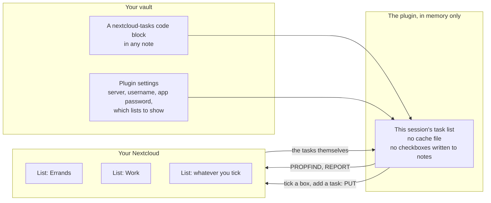

# Nextcloud Tasks for Obsidian

Read, create and complete your **Nextcloud Tasks** inside a note, over CalDAV.

Your tasks stay on your server. This plugin does not copy them into your vault, does not write
checkboxes into your notes, and does not keep a cache file that can drift out of sync. It fetches
what is there, shows it, and writes your changes straight back.

It is plain JavaScript with no dependencies and no native code, so the same build runs on the
desktop app and on a phone.



## Any lists, any names

There is no fixed set of categories and no folder convention. You load your task lists from the
server, tick the ones you want, and give each one a heading, a colour and a short key. The key is
what a note refers to. Two lists or nine, in whatever order you drag them into, is all the same to
the plugin.

## Install

**Manually:** download `main.js`, `manifest.json` and `styles.css` from the
[latest release](https://github.com/JUNSKIx1/obsidian-nextcloud-tasks/releases/latest) into
`<vault>/.obsidian/plugins/nextcloud-tasks/`, then enable it in Settings, Community plugins.

## Setup

1. In Nextcloud, go to Settings, Security, and create an **app password**. Use that, never your
   account password. It can be revoked on its own, and it is the only credential this plugin stores.
2. In Obsidian, open Settings, Nextcloud Tasks, and fill in the address (`https://cloud.example.com`,
   the base only, without `/remote.php/dav`), your username and the app password.
3. Press **Load**. Every task list on your account appears. Tick the ones you want, rename the
   headings, pick colours, and drag them into the order you want them grouped in.
4. Press **Test connection** if something does not work. It reports every step on its own, so a
   failure points at one line rather than at "could not connect".

Do not have a task list yet? **Create list** makes one on the server without leaving Obsidian.

## Showing tasks in a note

Put a fenced block in any note:

````markdown
```nextcloud-tasks
all
limit: 8
```
````

Every line is optional:

| Line | What it does |
| --- | --- |
| `all` (or an empty block) | every list you ticked, grouped by list. This is the default. |
| `list: errands` | one list only, by its key |
| `os: errands` | the same thing, kept working for notes written against older versions |
| `limit: 8` | show at most this many rows |
| `due: today` | only what is due today. **Overdue is always included**, or it would vanish silently |
| `due: week` | only what is due within seven days, overdue included |
| `done: true` | show completed tasks as well |
| `title: Shopping` | your own heading for the panel |

`due: heute`, `due: woche` and `done: ja` are accepted too, so a note keeps its meaning if you
switch Obsidian's language.

Rows sort the way you would triage them: overdue first, then by due date, undated last. Within one
day the higher priority wins, and a tie falls back to the order you put your lists in.

## Commands

| Command | What it does |
| --- | --- |
| **New task** | a small dialog: title, list, due date, priority |
| **Refresh tasks** | fetches now, instead of waiting for the next stale block |
| **Test connection** | walks discovery step by step and shows what each one answered |

There is no polling timer. The plugin fetches when Obsidian starts, when a block renders with data
older than a minute, when you run the command, and after you write something.

## Your phone

The same lists work in your phone's built-in reminders app: add a CalDAV account with the same
address, username and app password. You get notifications and widgets without Obsidian running, and
anything you tick there shows up here on the next refresh. The plugin itself also runs on the mobile
app if you would rather use it directly.

## Languages

English and German, following Obsidian's own language setting. You can also force one of them in the
plugin settings.

## Development

```bash
npm install
npm run lint          # eslint-plugin-obsidianmd, the same rules the directory review runs
npm test              # core, render and bundle suites: no install, no network, no credentials
npm run build         # bundles src/ into main.js
```

Deploy a local build into a vault:

```bash
VAULT="/path/to/your/vault" bash scripts/deploy-to-vault.sh
```

Against a real server, only with credentials in the environment and never in a file:

```bash
NC_URL=https://cloud.example.com NC_USER=alice NC_APP_PASSWORD=xxxxx-xxxxx \
  node scripts/live-check.mjs
```

It creates, reads, completes and deletes one test task. It proves the *server* speaks CalDAV. It
says nothing about whether Obsidian passes the verbs on your device, which is what **Test
connection** is for.

`main.js` is generated. Edit `src/`, never the bundle.

## Design notes

Things that look like details and are not:

- **Nothing is written to disk, not even as a cache.** The fetched list lives in memory for the
  session. That is what makes "your tasks live in Nextcloud" literally true, and it is why there is
  no file that can go stale.
- **Completing a task edits the original calendar object line by line** and copies every other byte
  through. Regenerating it from a parsed model would silently drop `RRULE`, `VALARM`, `CATEGORIES`
  and every `X-` property other clients wrote. The test asserts byte identity of untouched lines.
- **Completion is judged in the client**, because three clients express it three ways: `STATUS`,
  a bare `COMPLETED:` property, or `PERCENT-COMPLETE:100`. A server-side filter that gets this
  wrong hides tasks, which is worse than showing one too many.
- **`PRIORITY:0` means unset**, not "most urgent". RFC 5545 counts 1 as the highest.
- **Discovery walks the real chain**, `current-user-principal` to `calendar-home-set` to the
  collections in it, instead of guessing `/remote.php/dav/calendars/<user>/`. Fifteen lines, and one
  whole class of username casing bug disappears.
- **XML is read without caring about namespace prefixes.** Nextcloud's `d:` and `cal:` are not
  contractual.
- **If `REPORT` is refused**, the client falls back to `PROPFIND` plus one `GET` per object and
  remembers that for the session, so a platform that blocks the verb still works.
- **Everything goes through `requestUrl`**, which bypasses CORS and works on iOS.

## License

MIT. See [LICENSE](LICENSE).
